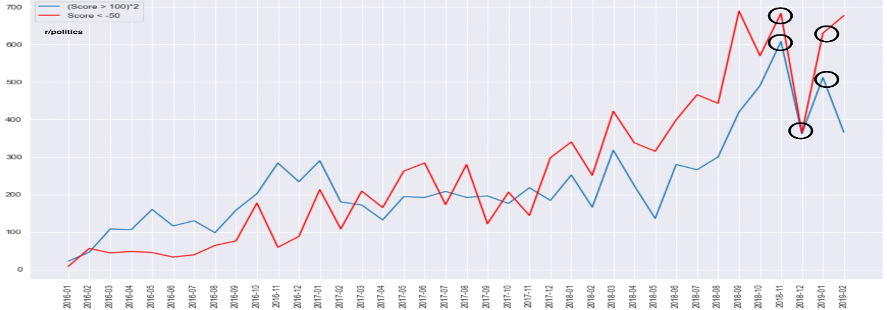
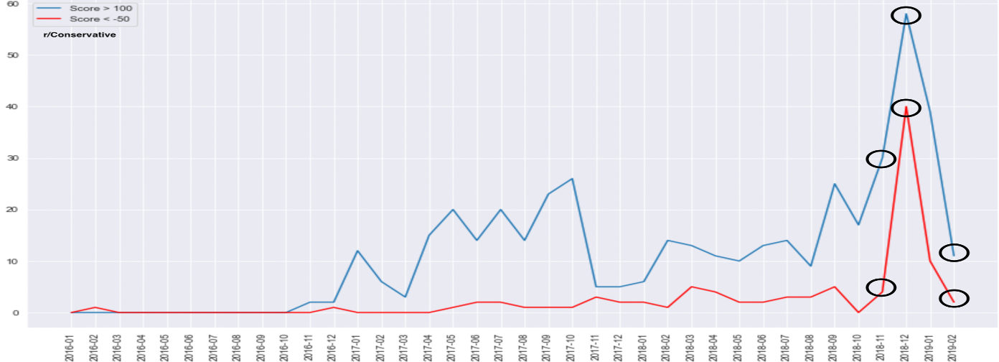
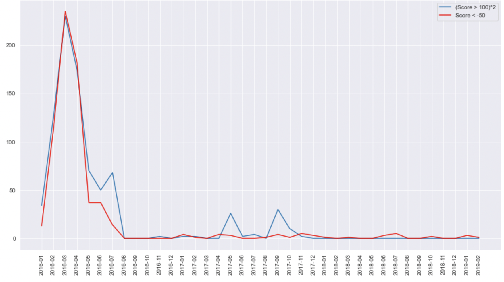
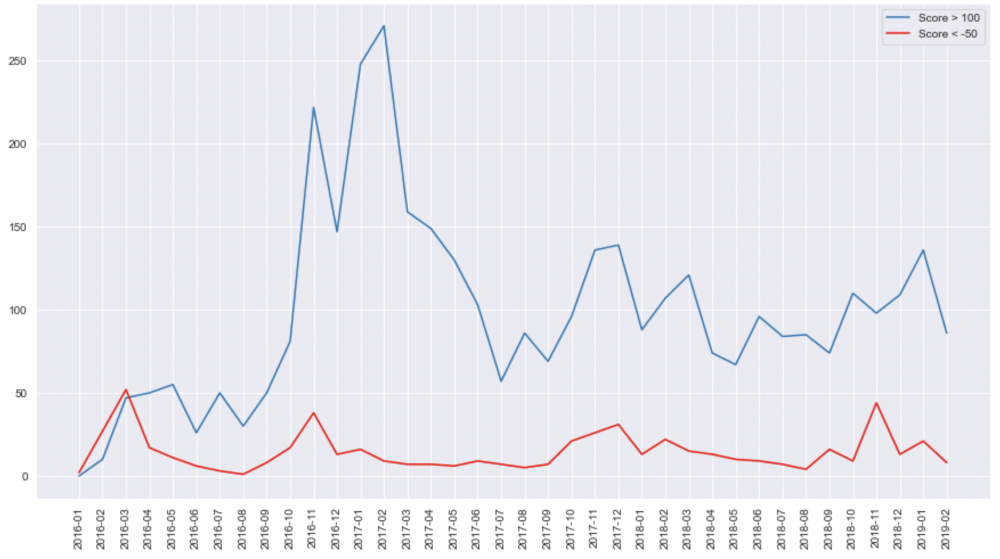
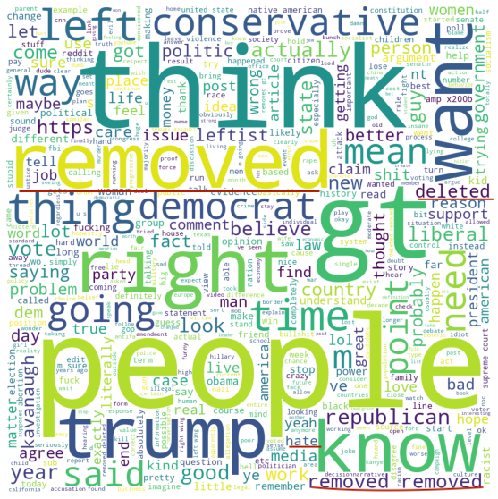
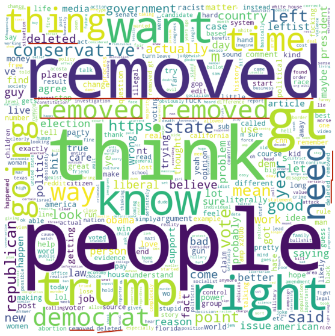
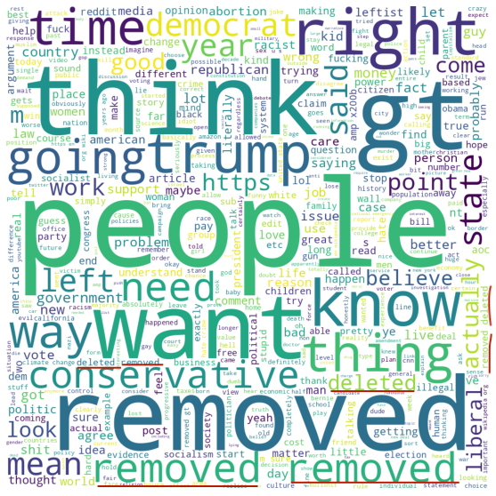
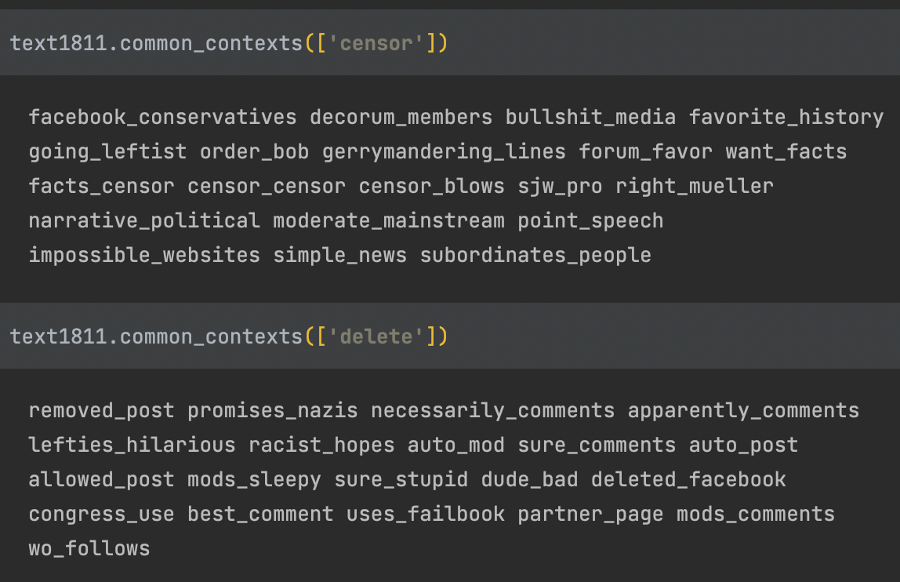
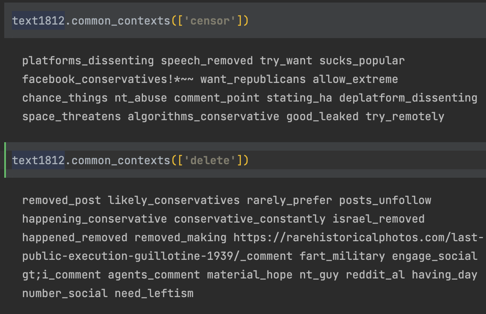

# replication-materials-sudhamshow
[](https://zenodo.org/badge/latestdoi/483592109)

## Research Question
Research question: Is there a significant shift in the discourse of language and user interaction on Reddit as a consequence of a mass content-moderation event?

## Preliminary Findings
Preliminary analysis of data collected from different subreddits (whose list is available in [/data/moderation.txt]
(/data/moderation.txt) indicated that out of the several subreddits of interest for which data was collected, only a 
few were worthy of analysis - those that had a discernible change (proportionally) in the amount of moderation 
events over time. 
Further analysis was only conducted on 3 months (11/2018, 12/2018 and 01/2019) on 2 subreddits that likely seems to 
show some interesting discourse in language.

The months and subreddits were selected based on the analysis of count of popular (score > 100 or < -50 (gained strong 
support or 
crticism from the community) ) post removals. 2 example plots are displayed below -

r/Politics


r/Conservative


Other subreddits with high content moderation, not considered for analysis -

r/SandersForPresident (Weak evidence of mass-moderation as there's only 1 month of high moderation)


r/The_Donald ( Low evidence of conflict (negative posts), and moreover the subreddit has been removed from the 
platform for various reasons )


One can observe a clear sign of conflict in the first 2 plots (the two plots follow each other closely). My 
hypothesis is that present setting of 
popular subreddits 
(even controversial ones) have diverse crowds. When people post controversial posts (identified by deletion by 
the moderator) that gain traction (support, by upvotes) in the community, people from the opposite ideology (hence 
probably the many downvotes) might offer a counter-argument opposing the initial posts, thus resulting in a conflict.
It is also possible that a user could go heretic and post things (or use of language) that do not align with the 
ideals of the group. These posts however get taken down as well. I am interested in further studying how this
(if) marginalised section responds or is impacted by content moderation in platforms that they can't garner support in.

Initial analysis of the most distinguising words in r/Conservative suggested an excessive use of markers of 
censorship (like 'delete', 'ban', 'removed', etc.) during 12/18 when content moderation was at its peak, compared to 
other months in the vicinity.

Wordclouds for most distinguishing words in r/Conservative for months 11/18, 12/18 and 01/19 in the same order -


  



Further semantic analysis (Key Word in Context - KWIC) reveal that words like 'ban', 'censor' and 'delete' were used 
in a more general setting in 11/18 as opposed to using it around 'conservatives' or 'republicans' as the subject in 
12/2018 when the moderation rose (awareness of conservatives being censored).

KWIC 18/11:



KWIC 18/12:



## Relevance to Research Question
The initial analysis points to discernible differences in the use of language (both syntactic and semantic). With 
this initial evidence of change in language discourse, I plan to use more sophisticated techniques to study the 
shift 
in language and behaviour (activity on reddit) with mass-moderation events as a treatment.

## Supplemental Code for replication

The code and data in this repository is provided for replication of initial findings of the final project for MACS 30200 "Perspectives on Computational Research" at the University of Chicago.

The code is written in Python 3.7.11 and all of its dependencies can be installed by running the following in the 
terminal (with the `requirements.txt` file included in this repository):

```
pip install -r requirements.txt
```

One can import the `analysis` module located in this repository to reproduce the analysis in the sections above:


To plot the count of moderation events use the `plot_mod_count` function in the `analysis` module to plot the count 
of removals of popular posts in already collected data (check [/data/count_mod.py](/data/count_mod.py) to collect 
counts for new data. The `plot_mod_count` 
function will reproduce the line charts in the initial finding section by taking the name of the subreddit as an 
input parameter.

The entire data is huge (several Gigabytes) and thus is not feasible to shared here. A subset of data along with 
preconstructed data frames with comments processed (tokenised) for analysis is available [here](https://drive.google.com/drive/folders/1XD4H8EmzjIgxKXmQ1bilG0uV3icnbg_A?usp=sharing).
For analysis on more collected data, please contact the author.

For e.g,
```python
import analysis

analysis.plot_mod_count('Conservative')
```
will plot the moderation counts for r/Conservative.

To plot wordclouds for a given dataframe, load pickled object (downloaded from the data repository in the link 
provided previously) 
into dataframe and use the `plot_word_cloud` function 
as decribed below:

```python
import analysis
import pandas
DF = pandas.read_pickle("path-to-pickled-object/Consv_1812.pkl")
analysis.plot_word_cloud(DF)
```

To find key word in context use the `print_kwic` function with the dataframe loaded in the previous step along with 
a keyword to print the contexts the keyword is most used in:
```python
import analysis
import pandas
DF = pandas.read_pickle("path-to-pickled-object/Consv_1812.pkl")
analysis.print_kwic(DF, 'delete')
```

If you found the data or code in this repository useful and are reusing it, I would appreciate it if you mentioned the 
source as 
[Zenodo DOI](https://doi.org/10.5281/zenodo.6501966) (see the "Cite as" section on my Zenodo page for more details).
